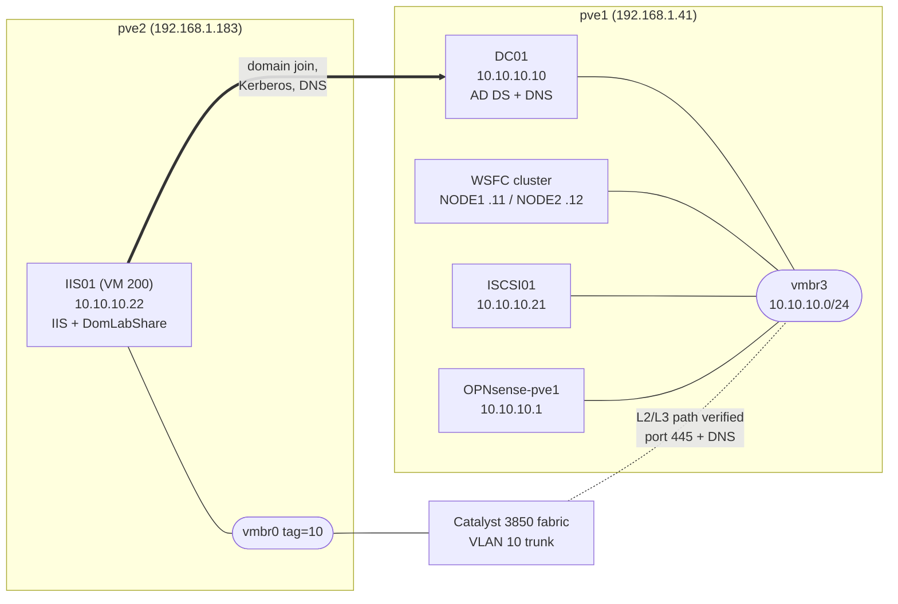
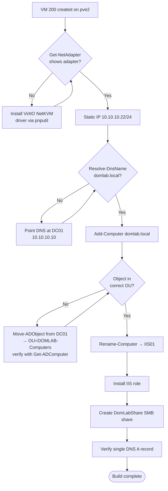

# domlab-ad-provisioning


Documentation of Active Directory provisioning work on the **DOMLAB.LOCAL** home lab domain — culminating in the build of **IIS01**, a dedicated member server, from bare VM to fully domain-joined with IIS and a file share role. Written as a real-world troubleshooting log, not a polished happy-path tutorial, because the debugging is the actual skill demonstration.

## Environment

| | Details |
|---|---|
| **Domain** | domlab.local (NetBIOS: DOMLAB) |
| **Domain Controller** | DC01 (VM 109, pve1, 10.10.10.10) — PDC Emulator, RID Master, Infrastructure Master |
| **Hypervisor** | Proxmox VE, multi-node cluster (`homelab-cluster`) |
| **Target VM** | IIS01 (VM 200), built on **pve2** — the domain identity subnet (10.10.10.0/24) normally lives only on pve1's internal `vmbr3` bridge, so this build proves connectivity from a second node via VLAN 10 tagging on `vmbr0` |
| **OS** | Windows Server 2022, Server Core |

## Architecture



## Build Flow



## Highlights

| Before | After |
|---|---|
|  |  |
| No NIC visible to Windows | VirtIO driver installed, adapter up |
|  |  |
| Object stuck in `CN=Computers` | Verified in `OU=DOMLAB-Computers` |
|  |  |
| Rename blocked | Renamed to IIS01, IIS installed |

## Repo Structure

```
domlab-ad-provisioning/
├── README.md                              ← this file
├── scripts/
│   ├── 01-network-setup.ps1               ← VirtIO driver, static IP, DNS
│   ├── 02-domain-join.ps1                 ← join + rename + OU placement (as it should be run cleanly)
│   ├── 03-fix-ou-placement.ps1            ← recovery script for the "joined into wrong container" scenario
│   ├── 04-iis-and-fileshare.ps1           ← IIS role + NTFS share
│   └── 05-dns-verification.ps1            ← A record check/create, run from DC01
├── docs/
│   └── troubleshooting-log.md             ← full blow-by-blow of every real issue hit during this build
└── screenshots/
    ├── MANIFEST.md                        ← maps every screenshot to its filename and what it shows
    └── *.png                              ← 33 screenshots from the actual build session
```

## Build Summary

| Step | Result |
|---|---|
| VM creation (Server Core, VirtIO NIC/SCSI) | Complete |
| VirtIO network driver install | Complete |
| Static IP (10.10.10.22/24) + DNS to DC01 | Complete |
| Domain join (domlab.local) | Complete |
| Computer object placement | `OU=DOMLAB-Computers` |
| Rename to IIS01 | Complete |
| IIS role install | Complete |
| NTFS file share (`DomLabShare`) | Complete |
| DNS A record | Confirmed, single clean entry |

## Architecture Note: Cross-Node Network Path

Every other domain-joined machine in this lab (DC01, both WSFC nodes, ISCSI01) lives on **pve1** specifically, because `vmbr3` — the bridge carrying the 10.10.10.0/24 identity subnet — is an internal-only bridge that exists solely on that node. Proxmox bridges are per-node; a VM's config can *reference* a bridge name that doesn't exist on the node it's actually running on, and Proxmox won't warn you.

IIS01 was deliberately built on **pve2** instead, using a VirtIO NIC tagged to **VLAN 10** on `vmbr0` (the physical uplink bridge) rather than `vmbr3`. This was an open question until tested directly:

```powershell
Test-NetConnection 10.10.10.10 -Port 445
# TcpTestSucceeded : True
```

Confirmed: VLAN 10 on pve2 has a real Layer 2/3 path to the domain subnet through the physical switch fabric, meaning member servers don't have to be pinned to pve1 the way the DC/WSFC/iSCSI stack currently is.

## Key Takeaways

- **Proxmox bridges are per-node.** A VM's network config can reference a bridge that simply doesn't exist on whatever node it lands on, and nothing warns you — Windows just shows zero adapters, or a service silently can't route.
- **PowerShell module/cmdlet availability is tied to installed roles**, not "being on a Windows Server." `ActiveDirectory`, `DnsServer`, and `GroupPolicy` modules all require their respective features/roles/RSAT tools before their cmdlets exist in a session.
- **No error ≠ success.** Multiple steps in this build produced no error text at all while doing nothing or doing the wrong thing. Verifying state after every mutating command — not just checking for red text — caught all of them.
- **A credential-shaped error isn't always a credential problem.** Isolating authentication (`net use`) from authorization (the actual operation) turned what looked like a password issue into the real root cause: object placement and AD delegation.

Full details on every issue hit and how it was root-caused: see [`docs/troubleshooting-log.md`](docs/troubleshooting-log.md).

## Related Work

- [`failover-cluster-witness`](https://github.com/Justdomi/failover-cluster-witness) — the two-node WSFC cluster this domain also supports
- iSCSI shared storage for the WSFC cluster (ISCSI01) — same domain-join pattern, built first (write-up coming)
